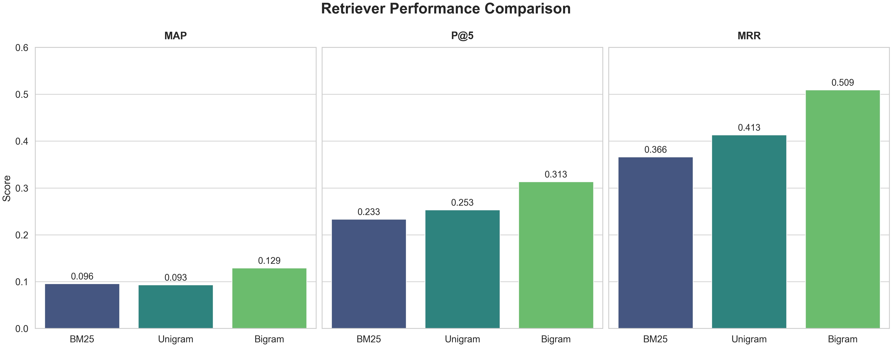

# 📚 Traditional Information Retrieval System


## 📖 Overview

This project implements fundamental **Information Retrieval (IR)** algorithms from scratch to fetch relevant documents for ad-hoc user queries. The system explores and compares three major probabilistic and heuristic models:

1.  **BM25**: A robust, industry-standard probabilistic retrieval framework.
2.  **Unigram Language Model**: Uses Dirichlet Smoothing to estimate document generation probabilities.
3.  **Bigram Language Model**: Leverages Linear Interpolation to capture word-pair context and dependency.

The goal is to analyze how considering term dependency (Bigram) and smoothing techniques impacts retrieval performance compared to the classic BM25 baseline.

---

## 📑 Table of Contents
- [Overview](#-overview)
- [Key Features](#-key-features)
- [Installation](#-installation)
- [Usage](#-usage)
- [Project Structure](#-project-structure)
- [Experimental Results](#-experimental-results)
- [License](#-license)

---

## 🚀 Key Features

*   **Custom Tokenization**: Specialized text preprocessing pipeline.
*   **Vectorized Implementation**: Efficient NumPy-based calculations for scoring.
*   **Hyperparameter Tuning**: Grid search implementation for:
    *   BM25: $k_1$ and $b$
    *   Unigram: $\mu$ (Dirichlet)
    *   Bigram: $\lambda$ (Interpolation)
*   **Evaluation Metrics**: Custom implementations of **MAP**, **MRR**, and **P@5**.

---

## 🛠 Installation

### Prerequisites
Ensure you have Python 3.10 or higher installed.

### 1. Clone the Repository
```shell
git clone https://github.com/your-username/traditional-retrieval.git
cd traditional-retrieval
```
### 2. Set up a Virtual Environment (Recommended)
```Shell
python -m venv .venv
source .venv/bin/activate  # On Windows: .venv\Scripts\activate
```
### 3. Install Dependencies
```Shell
pip install -r requirements.txt
```
### 4. Install Dev Dependencies (Optional)
If you wish to contribute or run linting tools:
```Shell
pip install -r dev-requirements.txt
pre-commit install
```
## 💻 Usage
To run the complete pipeline (preprocessing, tuning, training, and evaluation), execute the main run script:
```Shell
python -m pipeline.run
```
Ensure your dataset files are placed in the resources/ directory as configured in src/config_loader.py.
## 📂 Project Structure

```Text
.
├── pipeline/
│   └── run.py             # Main entry point for the pipeline
├── src/
│   ├── bm25_retriever.py  # BM25 Logic
│   ├── language_retriever.py # Unigram & Bigram Logic
│   ├── fine_tuning.py     # Hyperparameter grid search
│   ├── metrics.py         # Evaluator (MAP, MRR, P@5)
│   ├── utils.py           # Tokenization and helpers
│   └── ...
├── resources/
│   ├── raw/               # Dataset JSON files
│   └── vocab/             # Generated vocabulary artifacts
├── imgs/                  # Result plots
└── README.md
```
## 📊 Experimental Results
We evaluated the models on a test dataset containing ad-hoc queries. The Bigram Model demonstrated superior performance across all metrics, highlighting the importance of capturing phrase-level context.

| retriever         |P@5       |MRR       |MAP        |
| ------------------|----------|----------|-----------|
|BM25               |0.233     |0.366     |0.095      |
|Unigram            |0.253     |0.413     |0.092      |
|Bigram             |0.313     |0.509     |0.129      |

## Visualization
The following chart illustrates the performance gap between the methods:

## 📜 License
This project is licensed under the MIT License.